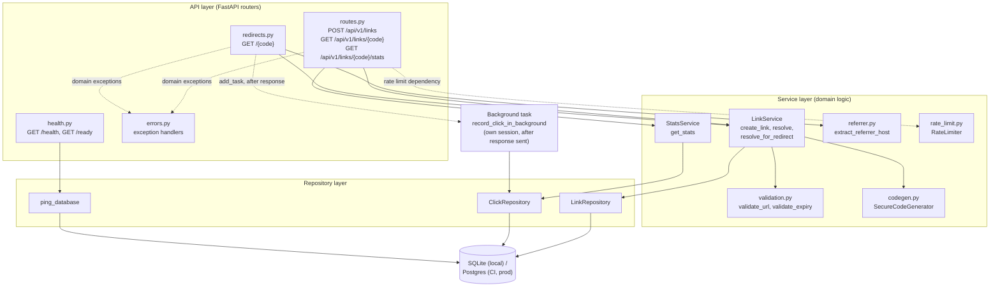
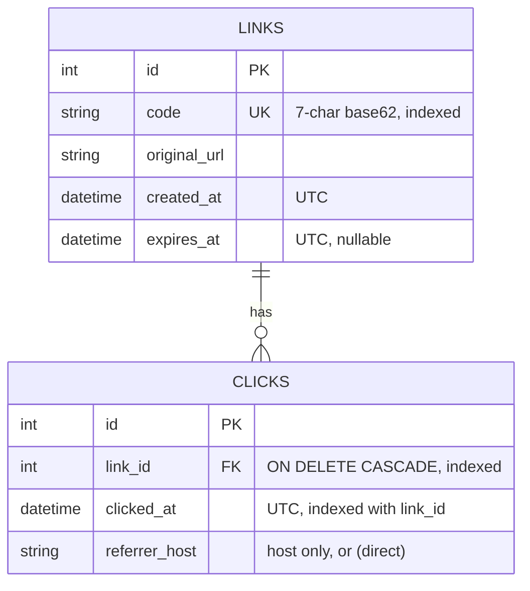
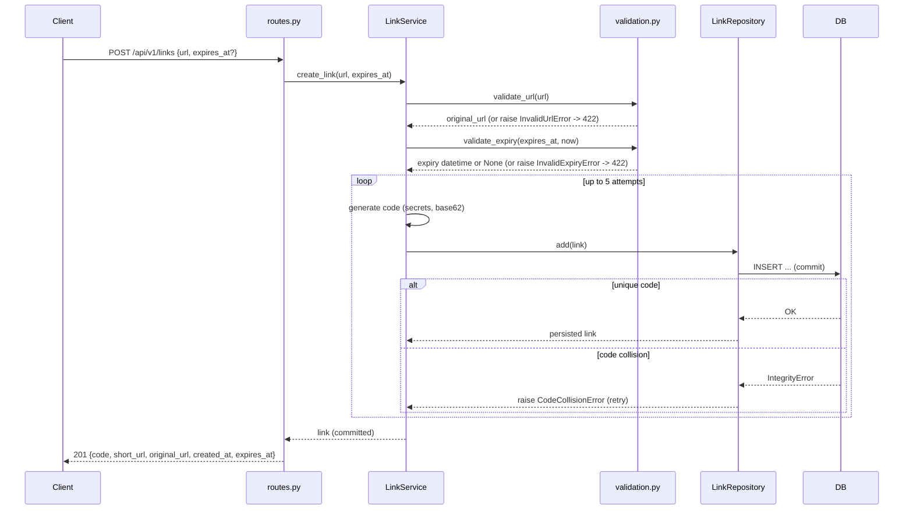
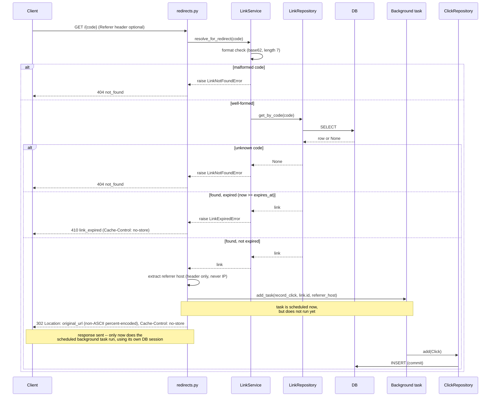

# Architecture

## Components

Layering is api → service → repository → DB (CLAUDE.md convention); no route
handler touches the DB or contains business logic.

Cross-cutting concerns (config, error handling) sit beside the layers rather
than inside them: `dependencies.py` wires per-request sessions and services;
`errors.py` maps every domain exception and framework exception to the one
JSON error shape.

## Data model

Indexes: `links.code` (unique), `clicks.link_id` and a composite
`(link_id, clicked_at)` supporting the stats aggregates (total, per-day,
top referrers) without loading click rows into Python. `clicks.link_id` has
`ON DELETE CASCADE`, so deleting a link removes its clicks (there is no
delete endpoint yet, but the constraint keeps the two tables consistent if
one is ever added, and SQLite foreign-key enforcement is turned on
app-wide to match Postgres — see AI_LOG.md § T-06 Phase B).

Both `created_at`/`expires_at`/`clicked_at` use a `UTCDateTime` type
(`models.py`) that normalizes every value to timezone-aware UTC on both
read and write, since SQLite otherwise drops timezone info.

## Sequence: create a link

The link is committed before the response is built (T-03 AC2): a client
that receives a 201 is guaranteed the link already exists for the next
request. Exhausting all 5 attempts raises `LinkCreationExhaustedError` ->
503 `code_space_exhausted`.

## Sequence: redirect

No click is scheduled for a 404 or a 410 (`add_task` is only reached on the
success path), and the background task uses its own session from the
session factory -- never the request's session, which is already closed by
the time background tasks run (ADR-001 D4).

## Cross-cutting concerns

- **Error shape:** every error response is
  `{"error": {"code", "message", "details"?}}`, produced by one handler per
  exception type in `errors.py`. `details` (validation errors only) carries
  field location and message, never the submitted value. Unhandled
  exceptions are logged server-side with a traceback and returned as a
  generic 500 -- clients never see internals.
- **Rate limiting:** `POST /api/v1/links` only, via a `Depends()` on the
  route decorator (not global middleware), so every other route is
  structurally unaffected. In-memory, per-key, fixed-window
  (`rate_limit.py`); keyed on `request.client.host`. 429 responses carry a
  `Retry-After` header.
- **Health vs ready:** `/health` makes no DB call (liveness only); `/ready`
  runs a trivial `SELECT 1` through the repository layer and returns 503
  `not_ready` if it fails.
- **UTC handling:** all persisted timestamps are timezone-aware UTC
  (`UTCDateTime`, `models.py`); on Postgres, `db.py` sets the session time
  zone to UTC so `date()` bucketing in `clicks_per_day` is correct
  regardless of server locale.
- **Configuration:** `config.py` (`Settings`, pydantic-settings) reads
  `DATABASE_URL`, `BASE_URL`, `RATE_LIMIT_MAX_REQUESTS`,
  `RATE_LIMIT_WINDOW_SECONDS` from the environment or a `.env` file; no
  secrets are hardcoded.

## Key decisions

- [ADR-001](adr/001-core-design-decisions.md) D1: random 7-char base62
  codes, not sequential IDs (non-guessable).
- [ADR-001](adr/001-core-design-decisions.md) D2: every create issues a new
  code, even for a duplicate URL (keeps per-channel analytics separable).
- [ADR-001](adr/001-core-design-decisions.md) D3: 302, not 301, redirects
  (every click reaches the service, so analytics stay complete and expiry
  takes effect immediately).
- [ADR-001](adr/001-core-design-decisions.md) D4: clicks are recorded in a
  background task, not synchronously (redirect latency is unaffected by
  the write); a message queue is the stated production path.
- [ADR-002](adr/002-link-expiry.md): links expire via an optional,
  creator-set `expires_at`; an expired redirect returns 410, but
  details/stats remain available.

## Testing strategy and CI

Unit tests cover domain logic in isolation (validation, code generation,
referrer extraction, rate limiting); integration tests exercise the full
stack (API -> service -> repository -> DB) via FastAPI's `TestClient`
against a real, migrated database. Locally this is a temporary SQLite file
per test session (`tests/conftest.py`); CI (`.github/workflows/ci.yml`) runs
the identical suite against a Postgres 16 service container on Python 3.12
and 3.13, so dialect-specific behaviour (timezone handling, foreign-key
enforcement, `date()` bucketing) is verified on the production database
engine, not assumed from SQLite. `scripts/check.py` is the single gate both
a developer and CI run: ruff check, ruff format --check, mypy --strict,
pytest with coverage (threshold 85%), and pip-audit -- stopping at the
first failure.
